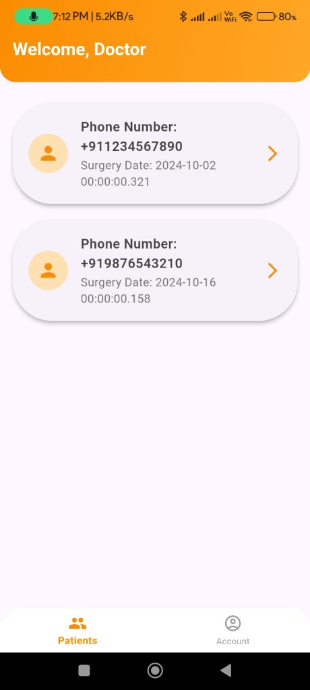
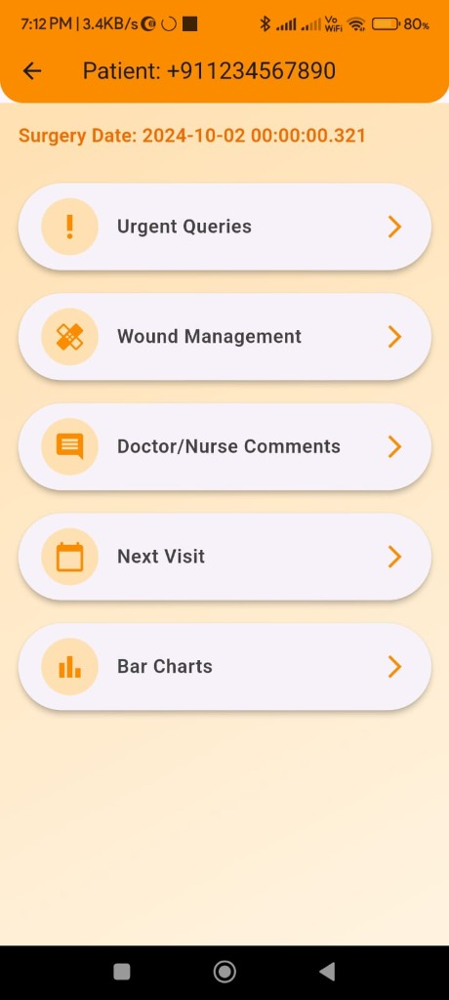
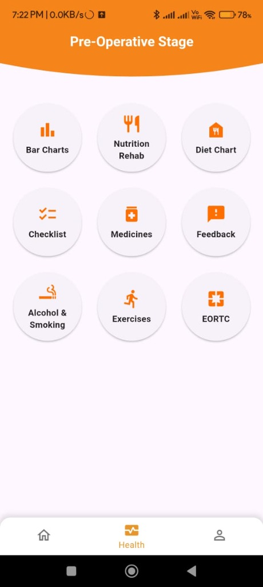

# ERAS Protocol App

The **ERAS (Enhanced Recovery After Surgery) Protocol App** is a comprehensive Flutter-based mobile application designed to streamline the surgical journey for both patients and doctors. It facilitates efficient communication, monitors patient progress, and ensures adherence to pre-operative and post-operative protocols.

## 🚀 Key Features

### For Doctors
- **Patient Management:** View and manage a list of patients.
- **Detailed Patient Insights:** Access detailed patient profiles and specific medical data.
- **Analytics Dashboard:** Visualize patient data and recovery trends using interactive charts (`fl_chart`).
- **Wound Management:** specialized tools for monitoring and managing wound healing.
- **Urgent Queries:** Dedicated interface to handle urgent patient concerns effectively.
- **Scheduling:** Manage and view next visit appointments.

### For Patients
- **Personalized Journeys:** Distinct interfaces tailored for **Pre-operative** and **Post-operative** phases.
- **Dashboard:** Centralized hub for daily tasks, notifications, and protocol adherence.
- **Guidance:** Step-by-step navigation and welcoming interfaces to guide patients through their recovery process.

## 🛠️ Tech Stack

- **Framework:** [Flutter](https://flutter.dev/) (Dart)
- **Backend:** [Firebase](https://firebase.google.com/)
  - **Authentication:** Phone Number Authentication
  - **Cloud Firestore:** Real-time NoSQL database for users and medical records
  - **Firebase Storage:** Secure media storage
- **State Management:** Provider
- **Key Packages:**
  - `fl_chart`: For data visualization and analytics.
  - `table_calendar`: For calendar and scheduling views.
  - `image_picker`: For handling image uploads (e.g., wound photos).
  - `video_player`: For educational or instructional video playback.

## 📂 Project Structure

```
lib/
├── aditya/         # Authentication, User Role logic, and Core Configurations
├── doctor/         # Doctor-facing screens (Dashboard, Patient Lists, Analytics)
├── home/           # Patient-facing screens
│   ├── pre_op/     # Pre-operative protocol interfaces
│   └── post_op/    # Post-operative protocol interfaces
└── main.dart       # Application entry point
```

## 📸 Screenshots

<p float="left">
  
   
  
  
  
  
  
  
</p>

## 🏁 Getting Started

### Prerequisites
- [Flutter SDK](https://docs.flutter.dev/get-started/install) installed.
- Valid Firebase configuration (ensure `firebase_options.dart` is correctly set up for your project environment).

### Installation

1. **Clone the repository:**
   ```bash
   git clone https://github.com/Syed-Suhaan/ERAS_Protocal.git
   cd ERAS_Protocal
   ```

2. **Install dependencies:**
   ```bash
   flutter pub get
   ```

3. **Run the app:**
   ```bash
   flutter run
   ```

## 🏆 App-a-thon 2024 Winner

This project was built during **App-a-thon 2024** held at **MIT Manipal**, where it secured the **First Position**! 🥇

The hackathon was organized by **Apple Developers' Group Manipal**, in collaboration with **Kasturba Medical College, Manipal** and **Innovation Centre - MAHE**.

### 👩‍🏫 Mentored by
- **[Preethi Shetty](https://www.linkedin.com/in/preethi-s-shetty-0455b88/)**

### 🌟 Contributors
Built with ❤️ by:
- **[Syed Suhaan](https://www.linkedin.com/in/syed-suhaan/)**
- **[Aditya Kosuru](https://www.linkedin.com/in/aditya-kosuru-rolcy/)**
- **[Saketh Ram Gorasa](https://www.linkedin.com/in/saketh-ram-gorasa-96433b282/)**
- **[Indumuri Riteesh](https://www.linkedin.com/in/riteesh-indumuri-b9aa80367/)**

## 🤝 Contributing

Contributions are welcome! Please feel free to submit a Pull Request.
